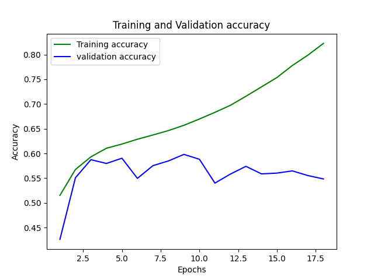

#### 2016a resnet18_outer dropout=0.5

#### 2016a resnet18_outer dropout=0.7

#### 2016b resnet18_outer dropout=0.5

#### 2016b resnet18_outer dropout=0.7

#### Comparison plot - 2016b resnet18_outer dropout=0.7 and 2016b resnet18_outer dropout=0.5

#### 2016b vtcnn2 dropout=0.5

#### 2016a renet18_outer + noise dropout = 0.5

